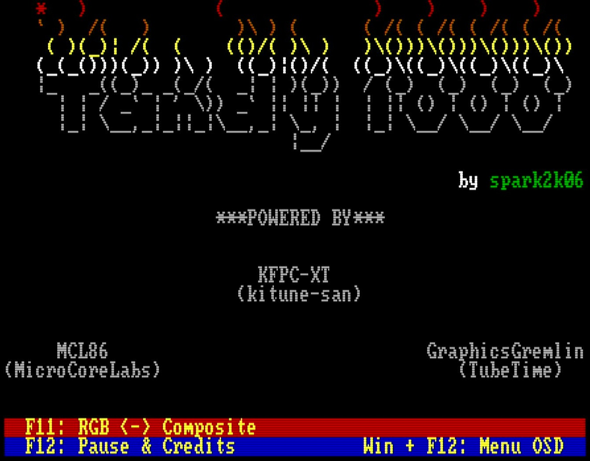

# [IBM Tandy 1000](https://en.wikipedia.org/wiki/Tandy_1000) for [MiSTer FPGA](https://mister-devel.github.io/MkDocs_MiSTer/)

Tandy 1000 port for MiSTer by [@spark2k06](https://github.com/spark2k06/).

Discussion and evolution of the core in the following misterfpga forum section:

https://misterfpga.org/viewforum.php?f=40

## Description

The purpose of this core is to implement a Tandy 1000 as reliable as possible. For this purpose, the [MCL86 core](https://github.com/MicroCoreLabs/Projects/tree/master/MCL86) from [@MicroCoreLabs](https://github.com/MicroCoreLabs/) and [KFPC-XT](https://github.com/kitune-san/KFPC-XT) from [@kitune-san](https://github.com/kitune-san) are used.

The [Graphics Gremlin project](https://github.com/schlae/graphics-gremlin) from TubeTimeUS ([@schlae](https://github.com/schlae)) has also been integrated in this first stage.

[JT89](https://github.com/jotego/jt89) by Jose Tejada (@jotego) was integrated for Tandy sound.

## Key features

* 8088 CPU with these speed settings: 4.77 MHz, 7.16 MHz, 9.54 MHz cycle accurate, and PC/AT 286 at 3.5MHz equivalent (max. speed)
* Support for IBM Tandy 1000
* Tandy graphics with 128Kb of shared RAM + CGA graphics
* Main memory 640Kb
* Simulated Composite Video, F11 -> Swap Video Output with RGB
* XTIDE support
* Audio: Tandy, speaker
* Joystick support
* Mouse support into COM1 serial port, this works like any Microsoft mouse... you just need a driver to configure it, like CTMOUSE 1.9 (available into hdd folder)
* 2nd SD card support

## Build configuration

This core uses a fixed configuration:

* System/ROM set to Tandy
* Tandy video, audio, and keyboard enabled
* CGA enabled as the baseline video path
* OPL2, CMS, EMS, A000 UMB, and HGC/MDA disabled

## Quick Start

* Copy the contents of `games/Tandy1000` to your MiSTer SD Card and uncompress `hd_image.zip`. It contains a FreeDOS image ( http://www.freedos.org/ )
* Select the core from Computers/Tandy1000.
* Press WinKey + F12 on your keyboard.
  * CPU Speed: PC/AT 3.5MHz (Max speed)
  * FDD & HDD -> HDD Image: FreeDOS_HD.img
  * BIOS -> Tandy BIOS: tandy.rom
* Choose Reset & apply settings.

## ROM Instructions

ROMs should be provided initially from the BIOS section of the OSD menu. The core has a single BIOS slot; on subsequent boots it is not necessary to provide them unless you want to use others. Original and copyrighted ROMs can be generated on the fly using the python scripts available in the SW folder of this repository:

* `make_rom_with_tandy.py`: A valid ROM is created for the Tandy core (tandy.rom) based on the original Tandy 1000 ROM.

Other Open Source ROMs are available in the same folder:

* `ide_xtl.rom`: XTIDE BIOS image used by ROM-generation scripts; it can be upgraded to a newer version. ([Source Code](https://www.xtideuniversalbios.org/))

## Other BIOSes

* https://github.com/640-KB/GLaBIOS

## Mounting the FDD image

The floppy disk image size must be compatible with the BIOS, for example:

* On Tandy 1000 only 360Kb images work well.
* Other BIOS may not be compatible, such as OpenXT by Ja'akov Miles and Jon Petroski.

It is possible to use images smaller than the size supported by the BIOS, but only pre-formatted images, as it will not be possible to format them from MS-Dos.

## Developers

Any contribution and pull request, please carry it out on the prerelease branch. Periodically they will be reviewed, moved and merged into the main branch, together with the corresponding release.

Thank you!
